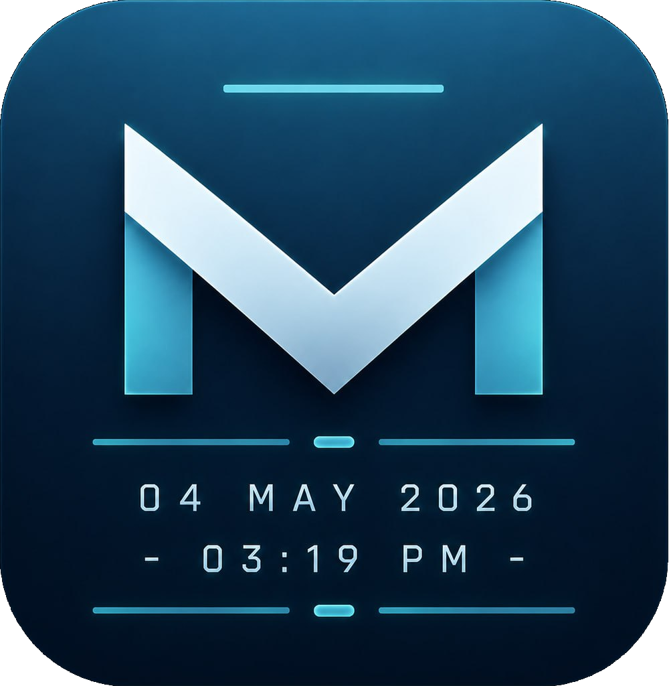
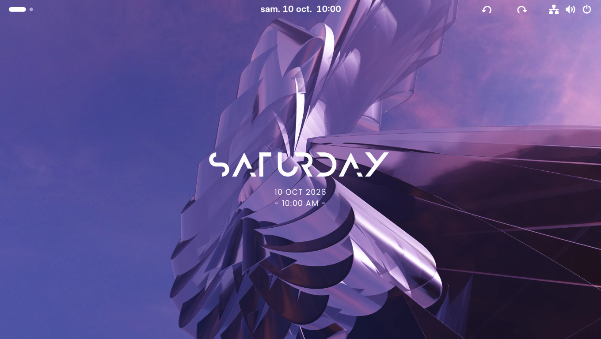
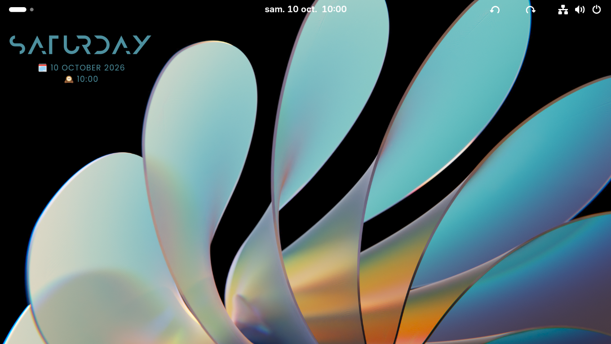
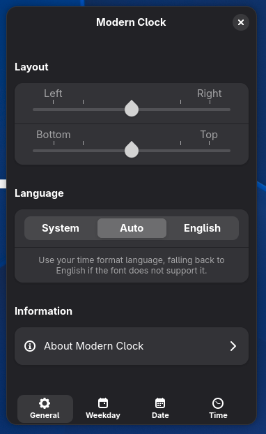
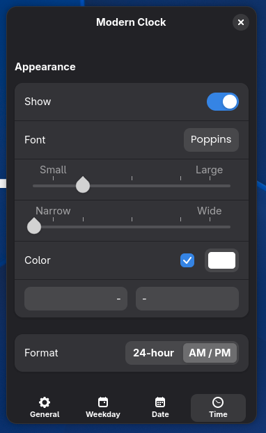

<div align="center">

[![Language: English][badge-readme-en]][readme-en]
[![Язык: Русский][badge-readme-ru]][readme-ru]
[![Langue : Français][badge-readme-fr]][readme-fr]

# Modern Clock for GNOME



**Un widget d’horloge à l'apparence moderne pour GNOME !**

[![Versions de GNOME prises en charge : 46 à 51][badge-shell]][ego-page]
[![Téléchargements sur GNOME Extensions][badge-downloads]][ego-page]
[![Licence][badge-license]][license]
</div>

## Fonctionnalités

Un widget d’horloge de bureau pour GNOME, inspiré de [Modern Clock for KDE][modern-clock-kde], avec les mêmes polices et la même apparence par défaut.

- **Positionnement** — peut être placé n’importe où sur le bureau
- **Mise à l’échelle automatique** — la taille du texte s’adapte à la taille de chaque écran (compatible HiDPI)
- **Prise en charge multi-écrans** — affiché sur chaque écran, avec mise à l’échelle indépendante
- **Langue** — respecte la langue du système, bascule en anglais si la police ne peut pas l’afficher, ou peut être forcé en anglais
- **Afficher ou masquer** le jour de la semaine, la date et l’heure indépendamment
- **Formats flexibles** — jour de la semaine complet ou abrégé, trois styles de date, heure au format 24 heures ou AM/PM
- **Personnalisable** — police, taille, espacement des lettres, couleur, ainsi que préfixes et suffixes personnalisés pour chaque ligne
- **Adapté au thème (optionnel)** — peut utiliser la couleur d’accentuation du système au lieu d’une couleur personnalisée

> [!NOTE]
> À la première activation, les polices incluses sont copiées dans `~/.local/share/fonts/modernclock`, et vous devez vous déconnecter puis vous reconnecter pour qu’elles prennent effet. Après la désinstallation de l’extension, vous pouvez supprimer ce dossier.

## Captures d’écran

<div align="center">




</div>

## Installation

### Depuis le site web GNOME Extensions (recommandé)

<a href="https://extensions.gnome.org/extension/9882/modern-clock/"></a>

### Depuis le dépôt

> [!NOTE]
> Si l’extension est installée depuis le dépôt, elle ne recevra pas les mises à jour automatiques du site web GNOME Extensions.

#### Option 1 : archive de version

Téléchargez `modernclock@gnome-port.zip` depuis la page des [versions][releases], puis installez l’extension avec :

```bash
gnome-extensions install -f modernclock@gnome-port.zip
```

#### Option 2 : compiler depuis les sources

```bash
git clone https://github.com/Tony-Rain/modern-clock-gnome.git
cd modern-clock-gnome
make install
```

#### Activer

Après l’installation de l’extension, déconnectez-vous puis reconnectez-vous (ou redémarrez simplement le GNOME shell avec `Alt+F2` > `r` sur X11), ensuite activez l’extension via l’application **Extensions** ou exécutez :

```bash
gnome-extensions enable modernclock@gnome-port
```

## Configuration

Ouvrez la fenêtre des préférences via l’application **Extensions** ou exécutez :

```bash
gnome-extensions prefs modernclock@gnome-port
```

<div align="center">




</div>

## Limitations connues

L’horloge ne s’affiche pas pendant les animations de changement d’espace de travail (Wayland uniquement), sur l’écran de verrouillage ni dans la vue d’ensemble des Activités. Cela s’explique par le fait que le widget se trouve dans la couche d’arrière-plan du GNOME shell.

## Traductions

Les traductions sont les bienvenues ! L’extension utilise `gettext`, donc les nouvelles langues n’ont besoin que d’un fichier `.po`. Les traductions de ce README sont également les bienvenues : copiez `README.md` vers `README.<lang>.md` (par exemple, `README.es.md`), traduisez-le, puis ajoutez-le au sélecteur de langue en haut de chaque README.

## Licence

Licence publique générale GNU, version 3 ou ultérieure. Voir [LICENSE][license].

Les polices incluses sont couvertes par leurs propres licences et ne font pas partie du code sous licence GPL.

## Remerciements

- Projet original : [Modern Clock for KDE][modern-clock-kde] par Prayag2
- Polices : [Anurati][anurati], [Poppins][poppins]

[badge-readme-en]: https://img.shields.io/badge/Language-English-3584e4
[badge-readme-fr]: https://img.shields.io/badge/Langue-Fran%C3%A7ais-9141ac
[badge-readme-ru]: https://img.shields.io/badge/%D0%AF%D0%B7%D1%8B%D0%BA-%D0%A0%D1%83%D1%81%D1%81%D0%BA%D0%B8%D0%B9-e01b24
[readme-en]: ./README.md
[readme-fr]: ./README.fr.md
[readme-ru]: ./README.ru.md
[ego-page]: https://extensions.gnome.org/extension/9882/modern-clock/
[license]: ./LICENSE
[badge-shell]: https://img.shields.io/badge/GNOME_versions-46_--_51-3584e4?logo=gnome
[badge-downloads]: https://img.shields.io/gnome-extensions/dt/modernclock%40gnome-port?logo=gnome&color=3584e4
[badge-license]: https://img.shields.io/github/license/Tony-Rain/modern-clock-gnome
[modern-clock-kde]: https://github.com/Prayag2/kde_modernclock
[releases]: https://github.com/Tony-Rain/modern-clock-gnome/releases
[anurati]: https://www.behance.net/gallery/33704618/ANURATI-Free-font
[poppins]: https://github.com/itfoundry/poppins
